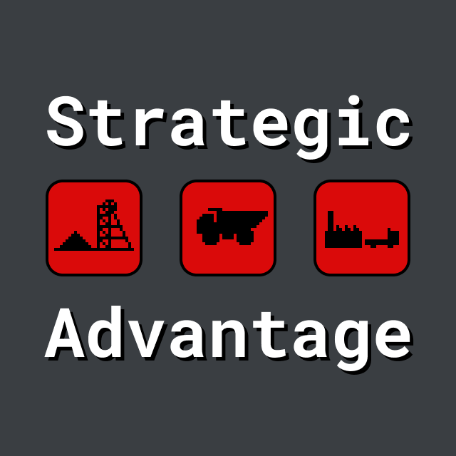

  <h1>
    
  </h1>
  
A massive online strategy game.

## Introduction

Strategic Advantage is an online strategy game played on one enormous map by thousands of players. Just like real life the game has no winner, just a bunch of people trying to coexist in a big, confusing world.

## Rules

- Each player controls multiple units.
- Some units if the game (such as "people") are "sentient".

Resources are dispersed through out the map with some areas rich resources and others poor in resources.

Players can only join the game through invitation from someone else.

Over time certain areas may become particular well equipped for producing a particluar units efficiently, making the area valuable despite it's natural resources. Hopefully this all leads to interesting geo-political dynamics. Will players band together and share resources? Will competition for resources result in war? Will democracy rise? Will powerful dictatorships sweep the land?

## Technical details

Serverless. Distributed. Immutable. Everything optimized for scale.